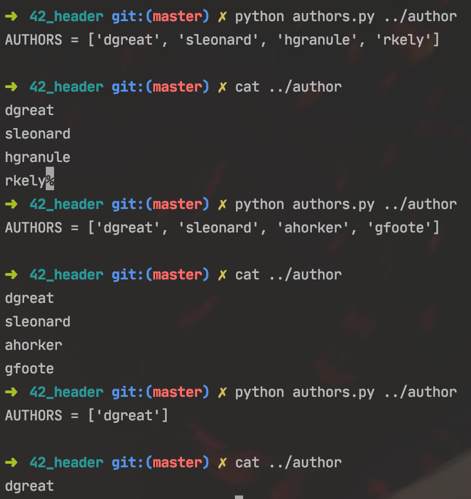
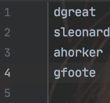

# 42header generator
python 42 header generator

NOW ONLY ON MAC

Usage: python header.py sources test.c   
Before usage don't forget to create config: 
python authors.py(in directory with author file*) or python authors.py [path to author] 
  

result : 
  
report about bugs: denis.mazohin@yandex.ru
-------------------------------------------------------------------------------
* author file is list of team -- for example

for me author is 
   
 for my team author is 
   

